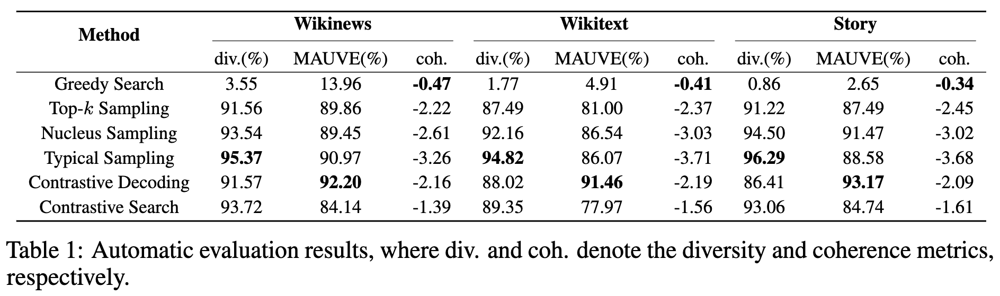
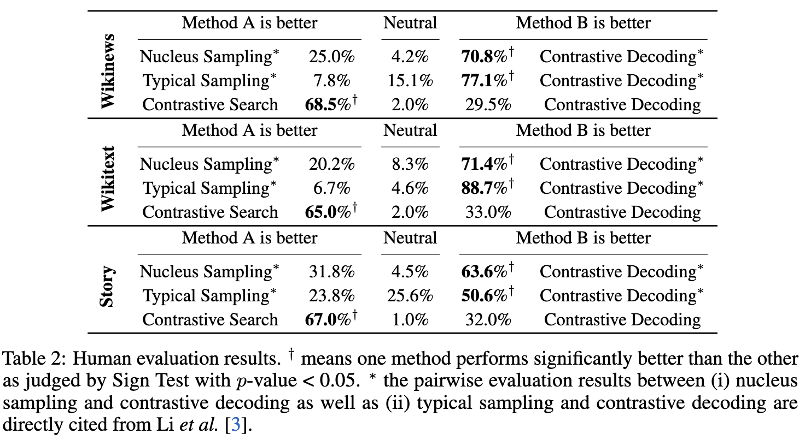

# An Empirical Study Of Contrastive Search And Contrastive Decoding For Open-ended Text Generation
**Authors**: Yixuan Su and Jialu Xu

**[Contact]** If you have any questions, feel free to contact me via (ys484 at cam.ac.uk).

****
If you find our paper and resources useful, please kindly leave a star and cite our papers. Thanks!

```bibtex
@article{su2022contrastiveiswhatyouneed,
  title={Contrastive Search Is What You Need For Neural Text Generation},
  author={Yixuan Su and Nigel Collier},
  journal={arXiv preprint arXiv:2210.14140},
  year={2022}
}

@inproceedings{su2022a,
  title={A Contrastive Framework for Neural Text Generation},
  author={Yixuan Su and Tian Lan and Yan Wang and Dani Yogatama and Lingpeng Kong and Nigel Collier},
  booktitle={Advances in Neural Information Processing Systems},
  editor={Alice H. Oh and Alekh Agarwal and Danielle Belgrave and Kyunghyun Cho},
  year={2022},
  url={https://openreview.net/forum?id=V88BafmH9Pj}
}
```


****

<span id='all_catelogue'/>

### Catalogue:
* <a href='#introduction'>1. Introduction</a>
* <a href='#environment_setup'>2. Environment Setup</a>
* <a href='#data'>3. Benchmark Data and Baseline Results</a>
* <a href='#inference'>4. Inference with Contrastive Search</a>
* <a href='#automatic_evaluation'>5. Automatic Evaluation</a>
    * <a href='#baseline_evaluation'>5.1. Evaluate Baseline Results</a>
        * <a href='#baseline_diversity_and_mauve'>5.1.1. Diversity and MAUVE</a>
        * <a href='#baseline_coherence'>5.1.2. Coherence</a>
* <a href='#human_evaluation'>6. Human Evaluation Results</a>
* <a href='#case_study'>7. Replicating Case Study Results of Contrastive Search</a>

****

<span id='introduction'/>

#### 1. Introduction: <a href='#all_catelogue'>[Back to Top]</a>

****

<span id='environment_setup'/>

#### 2. Environment Setup: <a href='#all_catelogue'>[Back to Top]</a>
Before running the experiments, please setup the environment as
```yaml
pip install torch
pip install simctg --upgrade
pip install mauve-text
pip install "transformers>=4.24.0"
```

****

<span id='data'/>

#### 3. Benchmark Data and Baseline Results: <a href='#all_catelogue'>[Back to Top]</a>
To ensure a fair comparsion with [Li _et al._ (2022)](https://arxiv.org/abs/2210.15097), we use the benchmark data provided by the authors [[here]](https://github.com/XiangLi1999/ContrastiveDecoding/tree/main/text-generation/outputs_ignorePrefix_ccnews_256). The results of compared baselines are also provided by the authors [[here]](https://github.com/XiangLi1999/ContrastiveDecoding/tree/main/text-generation/outputs_ignorePrefix_ccnews_256).

**[Note]** All benchmark data and baseline results are provided by [Li _et al._ (2022)](https://arxiv.org/abs/2210.15097) at the [authors' released repository](https://github.com/XiangLi1999/ContrastiveDecoding/tree/main/text-generation/outputs_ignorePrefix_ccnews_256).


> **** The details of the data directory is listed below:

    .
    └── ./data_from_CD_repo/             
        └── ./benchmarks/ # The folder that contains benchmark data.
            ├── ./wikinews_contrastive_gpt2-xl_256.jsonl # News domain benchmark data.
            ├── ./wikitext_contrastive_gpt2-xl_256.jsonl # Wikipedia domain benchmark data.
            └── ./book_contrastive_gpt2-xl_256.jsonl # Story domain benchmark data.
        └── ./wikinews/ # The folder that contains baseline results for the News domain.
            ├── ./wikinews_greedy_gpt2-xl_256.jsonl # Greedy search result.
            ├── ./wikinews_k-50_gpt2-xl_256.jsonl # Top-k sampling result.
            ├── ./wikinews_p-0.95_gpt2-xl_256.jsonl # Nucleus sampling result.
            ├── ./wikinews_typical-0.95_gpt2-xl_256.jsonl # Typical sampling result.
            └── ./wikinews_gpt2-0.8-t0.5_gpt2-xl_256.jsonl # Contrastive decoding result.
        └── ./wikitext/ # The folder that contains baseline results for the Wikipedia domain.
            ├── ./wikitext_greedy_gpt2-xl_256.jsonl # Greedy search result.
            ├── ./wikitext_k-50_gpt2-xl_256.jsonl # Top-k sampling result.
            ├── ./wikitext_p-0.95_gpt2-xl_256.jsonl # Nucleus sampling result.
            ├── ./wikitext_typical-0.95_gpt2-xl_256.jsonl # Typical sampling result.
            └── ./wikitext_gpt2-0.8-t0.5_gpt2-xl_256.jsonl # Contrastive decoding result.
        └── ./book/ # The folder that contains baseline results for the Story domain.
            ├── ./book_greedy_gpt2-xl_256.jsonl # Greedy search result.
            ├── ./book_k-50_gpt2-xl_256.jsonl # Top-k sampling result.
            ├── ./book_p-0.95_gpt2-xl_256.jsonl # Nucleus sampling result.
            ├── ./book_typical-0.95_gpt2-xl_256.jsonl # Typical sampling result.
            └── ./book_gpt2-0.8-t0.5_gpt2-xl_256.jsonl # Contrastive decoding result.

****

<span id='inference'/>

#### 4. Inference with Contrastive Search: <a href='#all_catelogue'>[Back to Top]</a>

        
****

<span id='automatic_evaluation'/>

#### 5. Automatic Evaluation: <a href='#all_catelogue'>[Back to Top]</a>
This section describes how to replicate the automatic evaluation results (i.e. the Figure below) for contrastive search as well as the baseline methods.



<span id='baseline_evaluation'/>

##### 5.1. Evaluate Baseline Results:

<span id='baseline_diversity_and_mauve'/>

###### 5.1.1. Diversity and MAUVE:
To evaluate the diversity and MAUVE results of the baseline methods, please run the following commands:
```yaml
chmod +x ./measure_CD_result.sh
./measure_CD_result.sh
```

The argument is as follows:
* `--test_path`: The file path of the baseline result, e.g. `./data_from_CD_repo/wikinews/wikinews_greedy_gpt2-xl_256.jsonl`.

**[Note]** After the evaluation is completed, the evaluated results will saved in the same directory as the `--test_path`, e.g. `./data_from_CD_repo/wikinews/wikinews_greedy_gpt2-xl_256_diversity_mauve_gen_length_result.json`.


<span id='baseline_coherence'/>

###### 5.1.2. Diversity and MAUVE:
To evaluate the coherence of the baseline methods, please run the following commands:
```yaml
chmod +x ./measure_CD_coherence.sh
./measure_CD_coherence.sh
```

The arguments are as follows:
* `--opt_model_name`: The OPT model used to measure the coherence. In our experiments, we use `facebook/opt-2.7b`.
* `--test_path`: The file path of the baseline result, e.g. `./data_from_CD_repo/wikinews/wikinews_greedy_gpt2-xl_256.jsonl`.

**[Note]** After the evaluation is completed, the evaluated results will saved in the same directory as the `--test_path`, e.g. `./data_from_CD_repo/wikinews/wikinews_greedy_gpt2-xl_256_opt-2.7b_coherence_result.json`.


****

<span id='human_evaluation'/>

#### 6. Human Evaluation Results: <a href='#all_catelogue'>[Back to Top]</a>
To ensure the reproducibility of our study, we also released the human annotations in our experiments of human evaluation.



The annotation file is provided [[here]](./human_evaluation_annotations/human_evaluation_annotations.json). To conduct human evaluation, we randomly select a subset of results generated by contrastive decoding and contrastive search given benchmarks from different domains. The complete results of contrastive decoding and contrastive search are provided in the Table below:

|News|Wikipedia|Story|
|:-------------:|:-------------:|:-------------:|
|[Results of Contrastive Decoding](./data_from_CD_repo/wikinews/wikinews_gpt2-0.8-t0.5_gpt2-xl_256.jsonl)|[Results of Contrastive Decoding](./data_from_CD_repo/wikitext/wikitext_gpt2-0.8-t0.5_gpt2-xl_256.jsonl)|[Results of Contrastive Decoding](./data_from_CD_repo/book/book_gpt2-0.8-t0.5_gpt2-xl_256.jsonl)|
|[Results of Contrastive Search]()|[Results of Contrastive Search]()|[Results of Contrastive Search]()|


To read the human evaluation results, you can simply run the following commands:
```yaml
cd ./human_evaluation_annotations/
python3 parse_human_annotation_results.py
```

The expected output is displayed as below.

```
========================================== Domain: Wikinews ==========================================
Contrastive Search is better at 68.5%; Two methods are comparable at 2.0%; Contrastive Decoding is better at 29.5%
------------------------------------------------------------------------------------------------------

========================================== Domain: Wikitext ==========================================
Contrastive Search is better at 65.0%; Two methods are comparable at 2.0%; Contrastive Decoding is better at 33.0%
------------------------------------------------------------------------------------------------------

========================================== Domain: Story ==========================================
Contrastive Search is better at 67.0%; Two methods are comparable at 1.0%; Contrastive Decoding is better at 32.0%
------------------------------------------------------------------------------------------------------
```
